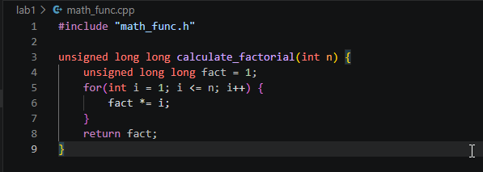
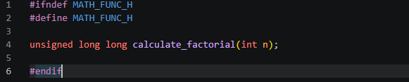
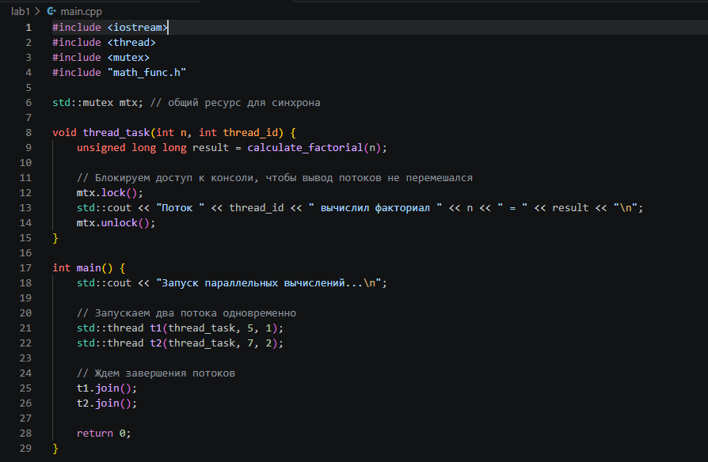
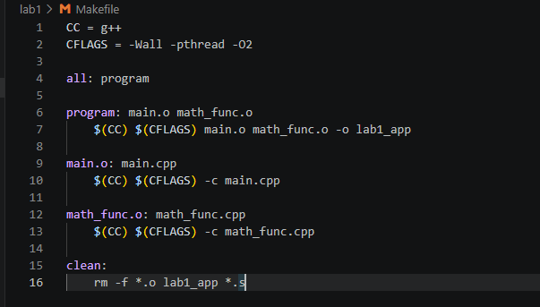
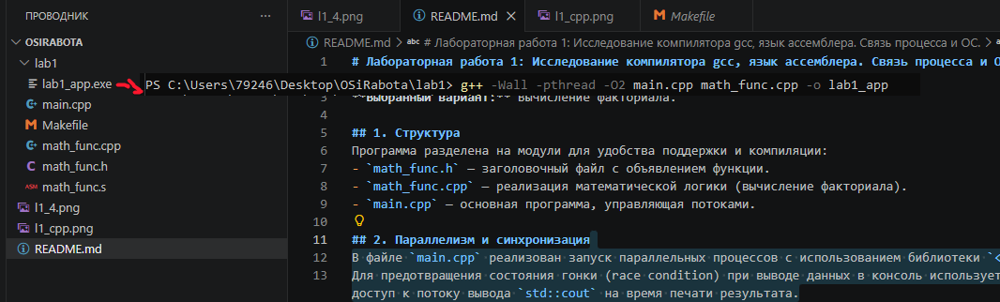
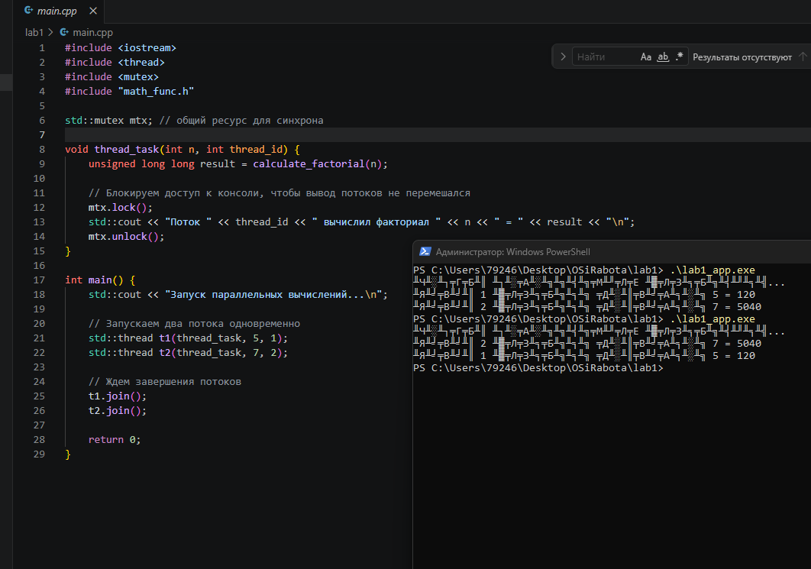
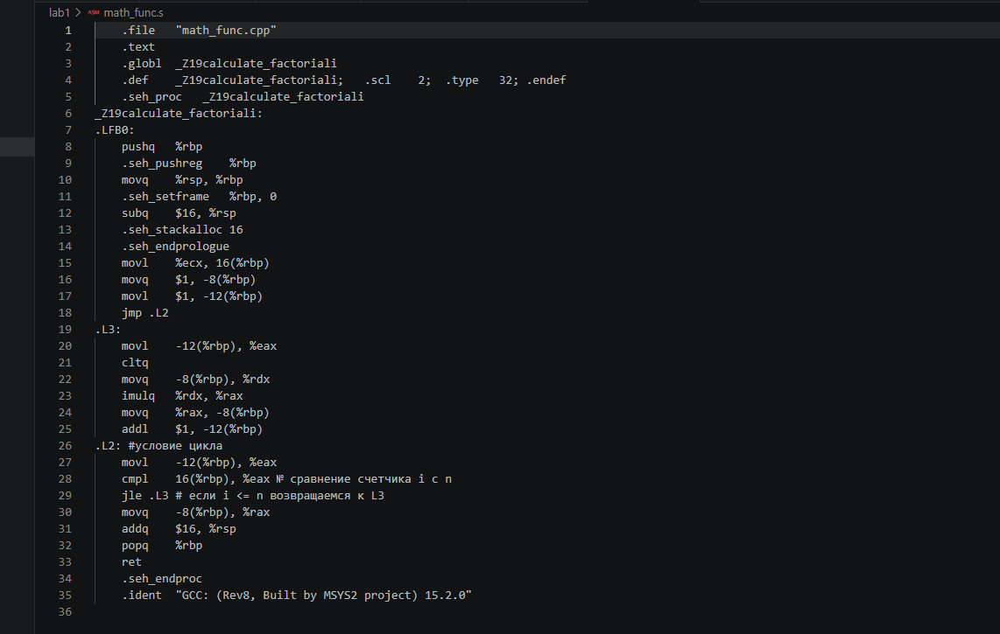

# Лабораторная работа 1: Исследование компилятора gcc, язык ассемблера. Связь процесса и ОС.

**Выбранный вариант:** Вычисление факториала.

## 1. Структура
Разбил код на три файла, чтобы всё логично структурировать и собирать через Makefile:
- `math_func.h` - заголовочный файл
- `math_func.cpp` - реализация математической логики
- `main.cpp` - основная программа, управляющая потоками

## 2. Синхронизация
В файле `main.cpp` Добавил библиотеку `<thread>`для параллельных вычислений. Чтобы потоки не перемешивали текст при одновременном выводе в консоль, повесил блокировку через (`std::mutex`) Поток захватывает мьютекс, печатает результат и отпускает его.

## 3. Сборка проекта (Makefile)
Для автоматизации сборки написан `Makefile`
- `make` - собирает экзешник `lab1_app` (с флагом `-pthread`).
- `make clean` - удаляет сгенерированные файлы

**Makefile**

**Скриншот процесса сборки:**

## 4. Демонстрация работы
При запуске скомпилированного файла инициализируются два потока, которые параллельно вычисляют факториалы для чисел 5 и 7.

**Скриншот результата работы:**

## 5. Ассемблер
Файл `math_func.cpp` был странслирован в язык ассемблера (диалект AT&T) с отключенной оптимизацией для наглядности:
`g++ -O0 -S math_func.cpp -o math_func.s`

В полученном файле `math_func.s` был найден основной цикл `for` (метки `.L2` и `.L3`), проанализированы инструкции инициализации счетчика, умножения (`imulq`) и логика перехода (`jle`). Код подробно прокомментирован внутри файла `math_func.s`.

